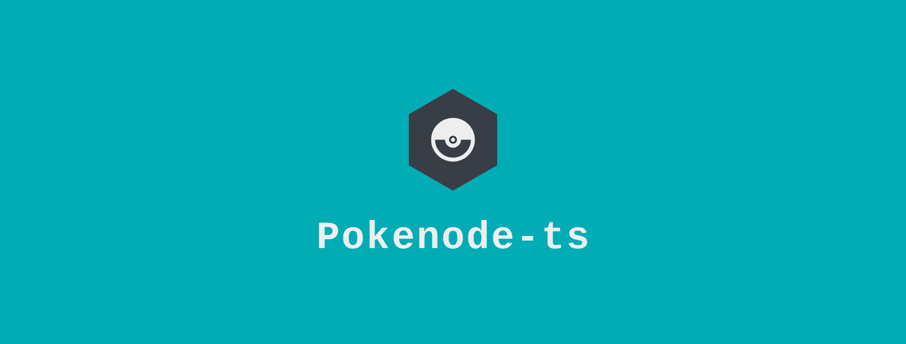

<p align="center">
  
  
  
  <a href="https://www.npmjs.com/package/pokenode-ts">
  
  </a>
</p>

## What it is

A lightweight Node.js wrapper for the PokéAPI with built-in types. An easy way to integrate your app with the PokéAPI.

## Features

- [Bulit-in typings](https://gabb-c.github.io/pokenode-ts/#/typings/berry-typings?id=berries)
- [Axios with auto-cache reqests](https://gabb-c.github.io/pokenode-ts/#/getting-started/cache)
- [Logging configuration](https://gabb-c.github.io/pokenode-ts/#/getting-started/logs)

## Installation

```bash
npm i pokenode-ts
# or
yarn add pokenode-ts # Recommended
```

## Basic Example

Using a client, like [PokemonClient](https://gabb-c.github.io/pokenode-ts/#/clients/pokemon-client):

```js
import { PokemonClient } from 'pokenode-ts';

(async () => {
  const api = new PokemonClient();

  await api
    .getPokemonByName('luxray')
    .then((data) => console.log(data.name)) // will output "Luxray"
    .catch((error) => console.error(error));
})();
```

Or, using the MainClient:

```js
import { MainClient } from 'pokenode-ts';

(async () => {
  const api = new MainClient();

  await api.pokemon
    .getPokemonByName('luxray')
    .then((data) => console.log(data.name)) // will output "Luxray"
    .catch((error) => console.error(error));
})();
```

## Documentation

Check out our [Documentation page](https://gabb-c.github.io/pokenode-ts/#/)!

## Insomnia Collection

If you want to test the PokéAPI endpoints, we recommend using [Insomnia](https://insomnia.rest/):

<div display="flex">
  <a href="https://insomnia.rest/run/?label=Pok%C3%A9API&uri=https%3A%2F%2Fraw.githubusercontent.com%2FGabb-c%2Fpokeapi-insomnia-collection%2Fmain%2Fpokeapi.json">
    
  </a>
  <a href="https://insomnia.rest/download">
    
  </a>
</div>

## Open in VS Code

Open Pokenode-ts in your Code, either using the [Remote Repositories extension](https://code.visualstudio.com/blogs/2021/06/10/remote-repositories), or [cloning in a Dev Container](https://code.visualstudio.com/docs/remote/containers):

[](https://open.vscode.dev/Gabb-c/pokenode-ts)

## Leave your feedback

- Did you like pokenode-ts? Give us a star ⭐
- Found a problem? Let us know by [creating an issue 🔎📑](https://github.com/Gabb-c/pokenode-ts/issues)
- Want to contribute? [Submit a PR](https://github.com/Gabb-c/pokenode-ts/pulls)

## Donate

Please consider donating if you think pokenode-ts is helpful to you or that my work is valuable. I am happy if you can buy me a coffee ❤️

<a href="https://www.buymeacoffee.com/pokenodets">
  
</a>
<a href="https://ko-fi.com/pokenodets">
  
</a>
<a href="https://www.paypal.com/donate?business=8TYDGB7874HT2&no_recurring=0&item_name=development&currency_code=USD">
  
</a>
